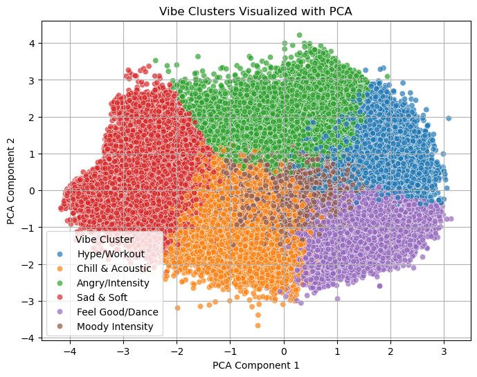
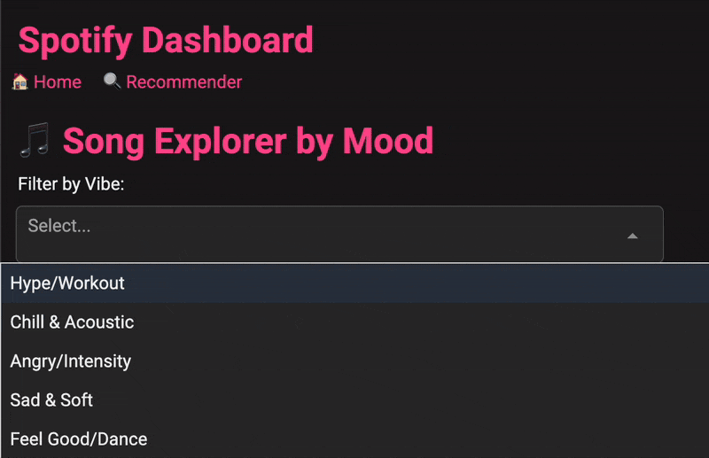
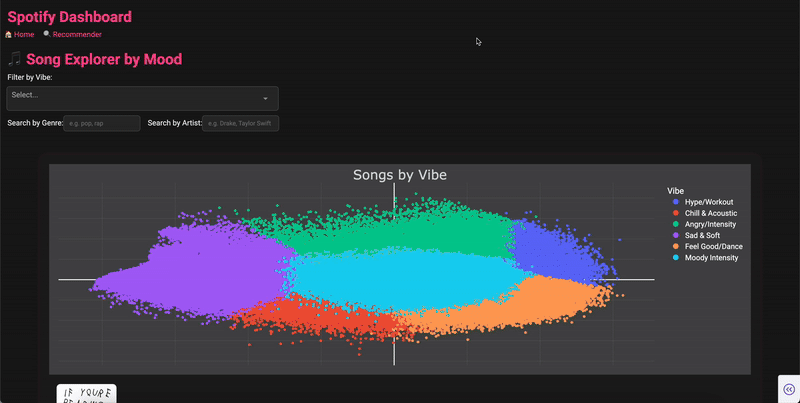
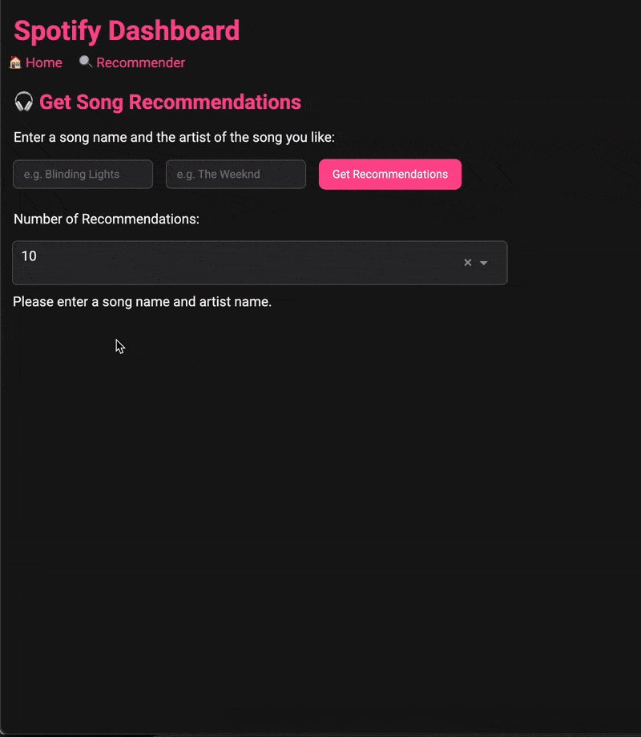

 
 
<a href="https://spotify-project-nk49.onrender.com/">Link to Plotly Dashboard</a>

<href></href>

## **Overview:**

This project explores a Spotify dataset sourced from Kaggle through **exploratory data analysis** (EDA) and **visualizations** to uncover **key patterns** in song characteristics. Leveraging these insights, I applied **Principal Component Analysis** (PCA) and built a **classification model** using **scikit-learn** to categorize songs into one of six distinct “vibe” **clusters**.

To bring this analysis to life, I developed an interactive web application using **Plotly Dash**. The app enables users to **explore** and **discover** music in a more personalized way using both genre and mood, a feature missing in most mainstream music discovery tools.

>**Song Explorer:** Filter and browse songs by **vibe** and **genre** to discover tracks that align with your mood and taste.
>
>**Recommender System:** Enter a song and artist name to receive **personalized recommendations** for similar tracks based on musical style and mood.

## **Dataset Overview**

I got the dataset from <a href="https://www.kaggle.com/datasets/zaheenhamidani/ultimate-spotify-tracks-db">Kaggle</a>.

Below is the first five rows of the dataset. Each row represents a unique song (or track).

|    | genre   | artist_name       | track_name                       | track_id               |   popularity |   acousticness |   danceability |   duration_ms |   energy |   instrumentalness | key   |   liveness |   loudness | mode   |   speechiness |   tempo | time_signature   |   valence |
|---:|:--------|:------------------|:---------------------------------|:-----------------------|-------------:|---------------:|---------------:|--------------:|---------:|-------------------:|:------|-----------:|-----------:|:-------|--------------:|--------:|:-----------------|----------:|
|  0 | Movie   | Henri Salvador    | C'est beau de faire un Show      | 0BRjO6ga9RKCKjfDqeFgWV |            0 |          0.611 |          0.389 |         99373 |    0.91  |              0     | C#    |     0.346  |     -1.828 | Major  |        0.0525 | 166.969 | 4/4              |     0.814 |
|  1 | Movie   | Martin & les fées | Perdu d'avance (par Gad Elmaleh) | 0BjC1NfoEOOusryehmNudP |            1 |          0.246 |          0.59  |        137373 |    0.737 |              0     | F#    |     0.151  |     -5.559 | Minor  |        0.0868 | 174.003 | 4/4              |     0.816 |
|  2 | Movie   | Joseph Williams   | Don't Let Me Be Lonely Tonight   | 0CoSDzoNIKCRs124s9uTVy |            3 |          0.952 |          0.663 |        170267 |    0.131 |              0     | C     |     0.103  |    -13.879 | Minor  |        0.0362 |  99.488 | 5/4              |     0.368 |
|  3 | Movie   | Henri Salvador    | Dis-moi Monsieur Gordon Cooper   | 0Gc6TVm52BwZD07Ki6tIvf |            0 |          0.703 |          0.24  |        152427 |    0.326 |              0     | C#    |     0.0985 |    -12.178 | Major  |        0.0395 | 171.758 | 4/4              |     0.227 |
|  4 | Movie   | Fabien Nataf      | Ouverture                        | 0IuslXpMROHdEPvSl1fTQK |            4 |          0.95  |          0.331 |         82625 |    0.225 |              0.123 | F     |     0.202  |    -21.15  | Major  |        0.0456 | 140.576 | 4/4              |     0.39  |

 

The Columns of the Dataset Include:

**`genre`**: what genre the song is 

**`artist_name`**: the artist name

**`track_name`**: the song name

**`track_id`**: the song id (unique to each song)

**`popularity`**: A score from 0 to 100 (higher = more popular), reflecting a track’s recent streaming counts and listener engagement.

**`acousticness`**: A confidence measure from 0.0 to 1.0 of whether the track is acoustic. 1.0 represents high
confidence the track is acoustic.

**`danceability`**: It describes how suitable a track is for dancing based on a combination of musical
elements including tempo, rhythm stability, beat strength, and overall regularity. A value of 0.0 is least
danceable and 1.0 is most danceable.

**`duration_ms`**: Length of the track in milliseconds. Divide by 1,000 to convert to seconds

**`energy`**: This is a measure from 0.0 to 1.0 and represents a perceptual measure of intensity and activity.
Typically, energetic tracks feel fast, loud, and noisy. For example, death metal has high energy, while a
Bach prelude scores low on the scale. Perceptual features contributing to this attribute include dynamic
range, perceived loudness, timbre, onset rate, and general entropy.

**`instrumentalness`**: Predicts whether a track contains no vocals. "Ooh" and "aah" sounds are treated as
instrumental in this context. Rap or spoken word tracks are clearly "vocal". The closer the
instrumentalness value is to 1.0, the greater likelihood the track contains no vocal content. Values above
0.5 are intended to represent instrumental tracks, but confidence is higher as the value approaches 1.0.

**`key`**: Integer (0–11) representing the musical key of the track using pitch class notation (0 = C, 1 = C♯/D♭, etc.). -1 indicates undetected.

**`liveness`**: Float (0.0–1.0): probability that a track was performed live. Values >0.8 typically indicate live recordings.

**`loudness`**: Overall loudness of the track in decibels (dB). Typical values range from about –60 to 0 dB

**`mode`**: Musical modality: 1 = major, 0 = minor.

**`speechiness`**: It detects the presence of spoken words in a track. The more exclusively speech-like the
recording (e.g. talk show, audio book, poetry), the closer to 1.0 the attribute value. Values above 0.66
describe tracks that are probably made entirely of spoken words. Values between 0.33 and 0.66 describe
tracks that may contain both music and speech, either in sections or layered, including such cases as rap
music. Values below 0.33 most likely represent music and other non-speech-like tracks.

**`tempo`**: Estimated tempo in beats per minute (BPM).

**`time_signature`**: Beats per bar (time signature), usually between 3 and 7 (e.g. 4 = 4/4 time)

**`valence`**: Float (0.0–1.0): musical positiveness conveyed by the track (happy vs. negative).

## **EDA**
First I got rid of any duplicate rows that were in the dataset, and then I checked for NaN values and there were none. meaning my dataset was now fully cleaned and had a row for each unique song id. Next I conducted 

### **Bivariate Analysis**

Below is a **scatter plot** showing the relationship between a song's **Danceability score** and its **Valence score** (i.e., how happy the song is):

<iframe
  src="assets/dance_vs_valence.html"
  width="800"
  height="600"
  frameborder="0"
></iframe>

 
There appears to be a **clear positive relationship** between the two where songs that are considered **more danceable** also tend to be **happier** in mood.

### **Aggregate Statistics**

**Reggae** is considered the **happiest music genre**, followed closely by **children's music**. On the other hand, genres like **opera** and **soundtrack** are among the **saddest** based on their average valence scores.

> *Note: The "soundtrack" genre refers to music used in films, television shows, video games, or other media.*

| genre            |   valence |
|:-----------------|----------:|
| Reggae           |  0.679775 |
| Children's Music |  0.675946 |
| Reggaeton        |  0.65999  |
| Ska              |  0.647291 |
| Blues            |  0.580323 |
| Country          |  0.534908 |

 

**Ska**, **electronic**, and **alternative** music are notably the **highest-energy genres**. In contrast, **classical** and **opera** have the **lowest average energy levels**, which aligns with their typically softer and more acoustic nature.

| genre            |   energy |
|:-----------------|---------:|
| Ska              | 0.836923 |
| Reggaeton        | 0.748457 |
| Electronic       | 0.739263 |
| Alternative      | 0.713933 |
| Children’s Music | 0.712646 |
| Dance            | 0.696151 |

## **Classifying Songs Into Moods**

My goal was to classify songs into specific **vibes** so that users could easily filter and discover music based on the **mood or energy** they were looking for. 

To achieve this, I used **Principal Component Analysis (PCA)** from the **scikit-learn** toolkit. The reason I chose PCA was because it helps **reduce the high-dimensional feature space** of the Spotify dataset (e.g., danceability, energy, valence, etc.) into a smaller number of components that **preserve most of the variance**. This not only made the data easier to visualize and interpret, but also helped improve clustering performance by removing noise and redundancy.

Using **PCA** along with clustering, I generated the following groups and **labeled each cluster** with a mood or "vibe" that best fits the songs within it.

### Cluster 0:
>Valence: 0.47 → neutral
>
>Energy: 0.41 → relaxed
>
>Danceability: 0.59 → somewhat danceable
>
>Acousticness: 0.76 → very acoustic
>
>Tempo: 108 BPM → moderate
>

**Mood/Vibe:**
>"Chill & Acoustic"
>
>Mellow, slightly upbeat acoustic tracks — coffee shop vibes, soft indie.

 

### Cluster 1:

>Valence: 0.70 → happy
>
>Energy: 0.77 → very energetic
>
>Danceability: 0.58 → somewhat danceable
>
>Acousticness: 0.16 → mostly electronic/instrumental
>
>Tempo: 157 BPM → very fast

**Mood/Vibe:**
>"Hype / Workout"
>
>High-energy, positive tracks — gym, running, EDM, fast pop.

 

### Cluster 2:

>Valence: 0.34 → a bit sad
>
>Energy: 0.71 → energetic
>
>Danceability: 0.57 → moderate
>
>Acousticness: 0.14 → electronic
>
>Tempo: 103 BPM → medium

**Mood/Vibe:**
>"Moody Intensity"
>
>Emotionally heavy but energetic — alt rock, rap, intense vibes.

 

### Cluster 3:

>Valence: 0.13 → very sad
>
>Energy: 0.16 → very calm
>
>Danceability: 0.28 → low
>
>Acousticness: 0.88 → very acoustic
>
>Tempo: 100 BPM → slow

**Mood/Vibe:**

>"Sad & Soft"
>
>Depressing or emotional acoustic tracks — breakup music, slow ballads.

 

### Cluster 4:

>Valence: 0.28 → sad
>
>Energy: 0.68 → high
>
>Danceability: 0.43 → low-moderate
>
>Acousticness: 0.18 → electronic
>
>Tempo: 154 BPM → fast

**Mood/Vibe:**

>"Angsty / Intense"
>
>Sad but energetic and fast — punk rock, fast rap, maybe rage-type music.

 

### Cluster 5:

>Valence: 0.74 → happy
>
>Energy: 0.69 → upbeat
>
>Danceability: 0.73 → very danceable
>
>Acousticness: 0.20 → electronic
>
>Tempo: 106 BPM → moderate

**Mood/Vibe:**

>"Feel-Good / Dance"
>
>Upbeat and fun — feel-good pop, party music, mainstream dance.

 

Below is a visualization of the clusters:

 

# **Plotly Dashboard**

I decided to use a **Plotly Dash** dashboard because it integrates seamlessly with **Python** and **Plotly visualizations**, allowing for the creation of **modern, interactive, and visually appealing** web pages.

## **Home Page**

### Buttons at the top for song and artist

The app features a **dropdown menu** that lets users select one or more **vibes** they’re interested in. Users can also **filter songs by genre** and **explore an artist's discography** in more detail by selecting a specific artist. This makes it easy to dive deeper into music that matches both the mood and the musical style you're looking for.

### Graph container

The plot displays **all the songs** in the dataset. When you **hover over a point**, it reveals key information about the song — including the **track title**, **artist name**, **genre**, and assigned **vibe**. The graph is **fully interactive** and updates dynamically based on the **vibe**, **genre**, and **artist** filters selected by the user.

Additionally, if you **click on a point**, more detailed information about that song is shown, along with a **clickable link to the song on Spotify**, allowing users to listen instantly.

### Output

The output below the graph displays the **top 10 songs** sorted by **popularity** that match the filters you’ve set. This allows users to easily **explore popular songs** within the specific **vibes** and **genres** they’re interested in!

 

## **Recommendation Page**

The **recommendation feature** lets users input a **song name** and the **artist**, and returns a list of songs that are most **similar** to it. Similarity is calculated using **cosine similarity** between the songs' audio features, helping users discover tracks with a similar vibe and style.

## Hosting

To **host the dashboard**, I used **Render**. When you first load the app, it might take a few moments since Render automatically puts the app to sleep when there's no activity for a while (to conserve resources). I also had to reduce the dataset from **175,000** to **100,000 unique songs** to stay within the **512 MB RAM** limit of the free plan. While the website may be a bit slow, I hope it effectively showcases the app's features and the overall structure of the project.

## Final Thoughts

This project combines **data science**, **machine learning**, and **interactive web development** to create a fun and personalized way to explore music. From clustering songs into mood-based vibes to building a dynamic dashboard for discovery and recommendations, I aimed to build something that’s both technically rich and engaging for users.

Whether you're curious about the mood distribution of your favorite genre, or looking for songs that match your current vibe, I hope this app provides an enjoyable and insightful experience.

Thank you for checking out my project!